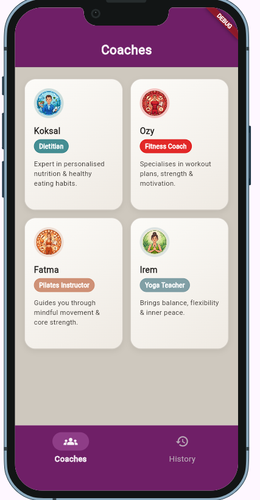
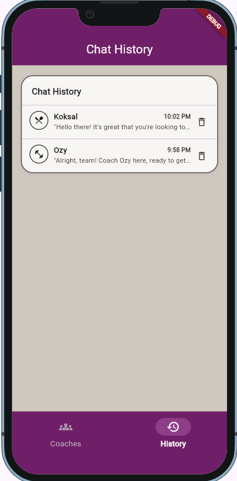
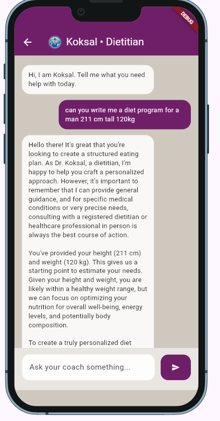

# Fitness App

A Flutter-based AI coach application with multiple personas (Dietitian, Fitness, Pilates, Yoga), chat history, and a themed mobile-first UI.

## Architecture Decisions

The app is structured by feature and follows a lightweight clean architecture split:

- `lib/core`: Cross-cutting concerns (constants, app theme, shared services).
- `lib/repositories`: Data-access orchestration for app features.
- `lib/services`: External integrations and persistence (`firebase_ai`, `remote_config`, local storage).
- `lib/domain`: Business models used across layers (`CoachPersona`, conversation models).
- `lib/features`: UI + state management per feature (`coaches`, `chat`, `history`, `home`).

Key decisions:

- **State management with `flutter_bloc` (Cubit):** chosen for predictable UI state and simple unidirectional data flow.
- **Repository pattern:** `CoachRepository` and `ChatRepository` isolate data sources from UI and make feature code easier to test.
- **Theming via central `ThemeColors`:** all colors are defined in one place to keep visual consistency and simplify design changes.
- **Persona-driven UI composition:** `CoachCard` accepts explicit inputs (`coachName`, `coachBranch`, etc.) while still supporting optional themed color overrides.
- **Asset-based avatars with fallback icons:** improves UX when an image is missing and avoids broken UI states.

## Project Structure

```text
lib/
	core/
	repositories/
	services/
	domain/
	features/
		coaches/
		chat/
		history/
		home/
```

## Run

From the project root:

```bash
flutter clean
flutter pub get
flutter run
```

Run on web (Chrome):

```bash
flutter run -d chrome
```

## Screenshots

These screenshots reflect the current running app:





## Notes

- Coach avatars are loaded from `assets/avatars/`.
